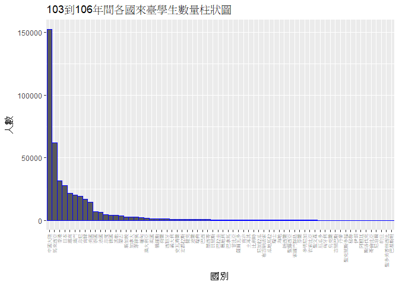
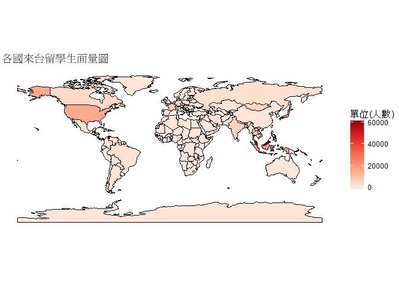
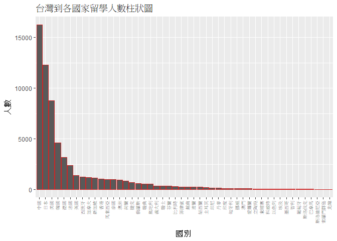
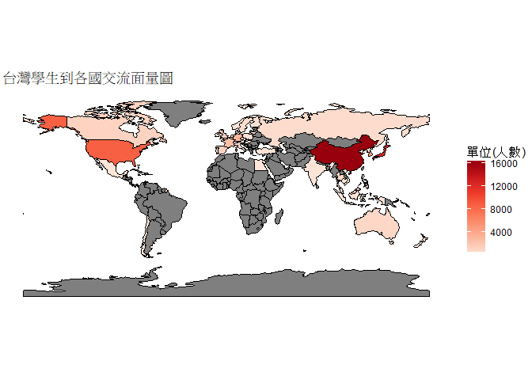
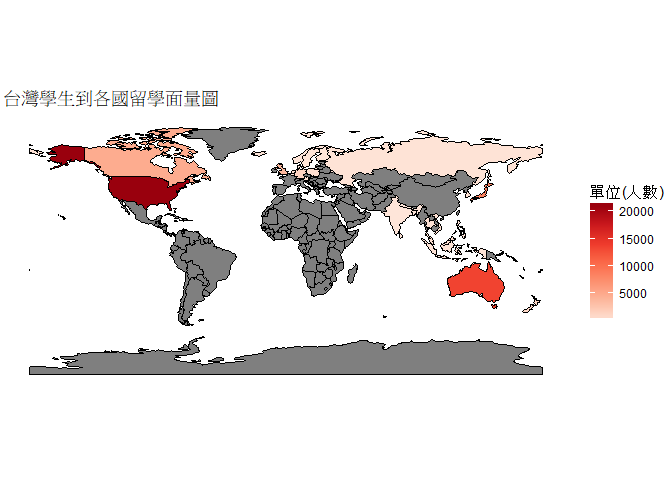
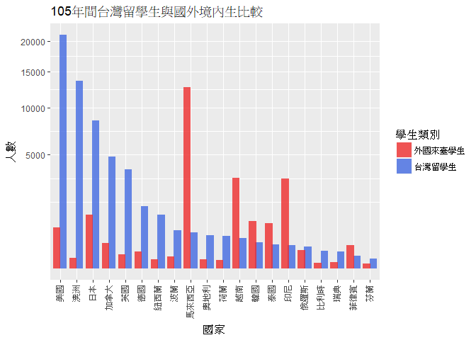
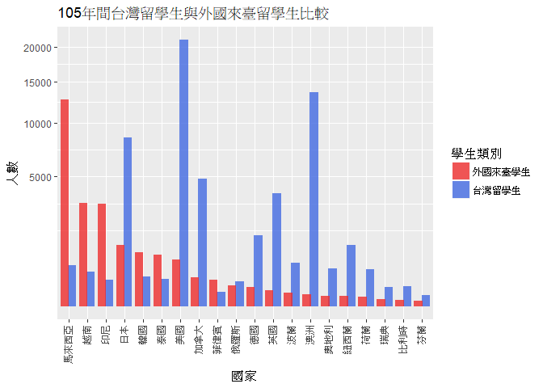

106-2 大數據分析方法 作業二
================
林辰建

作業完整說明[連結](https://docs.google.com/document/d/1aLGSsGXhgOVgwzSg9JdaNz2qGPQJSoupDAQownkGf_I/edit?usp=sharing)

學習再也不限定在自己出生的國家，台灣每年有許多學生選擇就讀國外的大專院校，同時也有人多國外的學生來台灣就讀，透過分析[大專校院境外學生人數統計](https://data.gov.tw/dataset/6289)、[大專校院本國學生出國進修交流數](https://data.gov.tw/dataset/24730)、[世界各主要國家之我國留學生人數統計表](https://ws.moe.edu.tw/Download.ashx?u=C099358C81D4876CC7586B178A6BD6D5062C39FB76BDE7EC7685C1A3C0846BCDD2B4F4C2FE907C3E7E96F97D24487065577A728C59D4D9A4ECDFF432EA5A114C8B01E4AFECC637696DE4DAECA03BB417&n=4E402A02CE6F0B6C1B3C7E89FDA1FAD0B5DDFA6F3DA74E2DA06AE927F09433CFBC07A1910C169A1845D8EB78BD7D60D7414F74617F2A6B71DC86D17C9DA3781394EF5794EEA7363C&icon=..csv)可以了解103年以後各大專院校國際交流的情形。請同學分析以下議題，並以視覺化的方式呈現分析結果，呈現103年以後大專院校國際交流的情形。

來台境外生分析
--------------

### 資料匯入與處理

``` r
library(readr)
###匯入103、104、105、106年間，外國留學生相關資訊。
###data_xxx_FStu_Country代表在民國xxx年間，各國來台留學生資訊。
###data_xxx_FStu_School代表在民國xxx年間，台灣各大專院校的外籍留學生資訊。
data_103_FStu_Country <- read_csv("https://quality.data.gov.tw/dq_download_csv.php?nid=6289&md5_url=25f64d5125016dcd6aed42e50c972ed0")
data_103_FStu_School <- read_csv("https://quality.data.gov.tw/dq_download_csv.php?nid=6289&md5_url=a6d1469f39fe41fb81dbfc373aef3331")
data_104_FStu_Country <- read_csv("https://quality.data.gov.tw/dq_download_csv.php?nid=6289&md5_url=4d3e9b37b7b0fd3aa18a388cdbc77996")
data_104_FStu_School <- read_csv("https://quality.data.gov.tw/dq_download_csv.php?nid=6289&md5_url=8baeae81cba74f35cf0bb1333d3d99f5")
data_105_FStu_Country <- read_csv("https://quality.data.gov.tw/dq_download_csv.php?nid=6289&md5_url=19bedf88cf46999da12513de755c33c6")
data_105_FStu_School <- read_csv("https://quality.data.gov.tw/dq_download_csv.php?nid=6289&md5_url=1a485383cf9995da679c3798ab4fd681")
data_106_FStu_Country <- read_csv("https://quality.data.gov.tw/dq_download_csv.php?nid=6289&md5_url=50e3370f9f8794f2054c0c82a2ed8c91")
data_106_FStu_School <- read_csv("https://quality.data.gov.tw/dq_download_csv.php?nid=6289&md5_url=883e2ab4d5357f70bea9ac44a47d05cc")


library(dplyr)
###將103中，各學程的外籍學生人數加總，並另存於新欄位FStudent_103。
data_103_FStu_Country <- mutate(data_103_FStu_Country, FStudent_103 = `學位生-正式修讀學位外國生`+ `學位生-僑生(含港澳)`+
  `學位生-正式修讀學位陸生`+ `非學位生-外國交換生`+ `非學位生-外國短期研習及個人選讀`+ `非學位生-大專附設華語文中心學生`+
  `非學位生-大陸研修生`+ `非學位生-海青班`+ 境外專班)

###將104中，各學程的外籍學生人數加總，並另存於新欄位FStudent_104。
data_104_FStu_Country <- mutate(data_104_FStu_Country, FStudent_104 = `學位生-正式修讀學位外國生`+ `學位生-僑生(含港澳)`+
  `學位生-正式修讀學位陸生`+ `非學位生-外國交換生`+ `非學位生-外國短期研習及個人選讀`+ `非學位生-大專附設華語文中心學生`+
  `非學位生-大陸研修生`+ `非學位生-海青班`+ 境外專班)

###將105中，各學程的外籍學生人數加總，並另存於新欄位FStudent_105。
data_105_FStu_Country <- mutate(data_105_FStu_Country, FStudent_105 = 學位生_正式修讀學位外國生+ `學位生_僑生(含港澳)`+
  學位生_正式修讀學位陸生+ 非學位生_外國交換生+ 非學位生_外國短期研習及個人選讀+ 非學位生_大專附設華語文中心學生+
  非學位生_大陸研修生+ 非學位生_海青班+ 境外專班)

###將106中，各學程的外籍學生人數加總，並另存於新欄位FStudent_106。
data_106_FStu_Country <- mutate(data_106_FStu_Country, FStudent_106 = 學位生_正式修讀學位外國生+ `學位生_僑生(含港澳)`+
  學位生_正式修讀學位陸生+ 非學位生_外國交換生+ 非學位生_外國短期研習及個人選讀+ 非學位生_大專附設華語文中心學生+
  非學位生_大陸研修生+ 非學位生_海青班+ 境外專班)

###將103、104、105、106年的資料依照'國別'合併，並另存成新的資料框Total。
Total <- full_join(data_103_FStu_Country, data_104_FStu_Country, by = '國別')
Total <- full_join(Total, data_105_FStu_Country, by = '國別')
Total <- full_join(Total, data_106_FStu_Country, by = '國別')

Total[is.na(Total)] <- as.numeric(0)
```

### 哪些國家來台灣唸書的學生最多呢？

``` r
###將Total資料框中103、104、105、106年間的留學生人數加總後另存成新欄位Total_FStudent，在依照Total_FStudent由大到小排列。
Total <- mutate(Total, Total_FStudent = FStudent_103+ FStudent_104+ FStudent_105+ FStudent_106,)%>%
  arrange(desc(Total_FStudent))

###將Total資料框中，在台留學生人數少於200的國家合併，另存成"其他"，並將不需要的資訊刪除，另存於新的資料框Total_Concise。
Else <- filter(Total,Total_FStudent<200)%>%summarise(Else_Total = sum(Total_FStudent))
Total_Concise <- Total[,c(2,46)]%>%filter(Total_FStudent>= 200)%>% rbind(c("其他",Else$Else_Total))
Total_Concise$Total_FStudent <- as.numeric(Total_Concise$Total_FStudent)


TOP_10_Country <- head(Total_Concise,10)
knitr::kable(TOP_10_Country)
```

| 國別     |  Total\_FStudent|
|:---------|----------------:|
| 中國大陸 |           152524|
| 馬來西亞 |            62031|
| 香港     |            31940|
| 日本     |            28200|
| 越南     |            21670|
| 澳門     |            20302|
| 印尼     |            19620|
| 南韓     |            16948|
| 美國     |            14846|
| 泰國     |             7035|

### 哪間大學的境外生最多呢？

``` r
###資料中的"…"轉為0。
data_103_FStu_School$`非學位生-大陸研修生`[grepl("…", data_103_FStu_School$`非學位生-大陸研修生`)] <- 0
data_104_FStu_School$`非學位生-大陸研修生`[grepl("…", data_104_FStu_School$`非學位生-大陸研修生`)] <- 0
data_103_FStu_School$`非學位生-大陸研修生` <- as.numeric(data_103_FStu_School$`非學位生-大陸研修生`)
data_104_FStu_School$`非學位生-大陸研修生` <- as.numeric(data_104_FStu_School$`非學位生-大陸研修生`)

###將103中，各大專院校中，不同學程的外籍學生人數加總，並另存於新欄位FStudent_103。
data_103_FStu_School <-mutate(data_103_FStu_School, FStudent_103 = `學位生-正式修讀學位外國生`+ `學位生-僑生(含港澳)`+
  `學位生-正式修讀學位陸生`+ `非學位生-外國交換生`+ `非學位生-外國短期研習及個人選讀`+ `非學位生-大專附設華語文中心學生`+
  `非學位生-大陸研修生`+ `非學位生-海青班`+ 境外專班)

###將104中，各大專院校中，不同學程的外籍學生人數加總，並另存於新欄位FStudent_104。
data_104_FStu_School <- mutate(data_104_FStu_School, FStudent_104 = `學位生-正式修讀學位外國生`+ `學位生-僑生(含港澳)`+
  `學位生-正式修讀學位陸生`+ `非學位生-外國交換生`+ `非學位生-外國短期研習及個人選讀`+ `非學位生-大專附設華語文中心學生`+
  `非學位生-大陸研修生`+ `非學位生-海青班`+ 境外專班)

###將105中，各大專院校中，不同學程的外籍學生人數加總，並另存於新欄位FStudent_105。
data_105_FStu_School <- mutate(data_105_FStu_School, FStudent_105 = 學位生_正式修讀學位外國生+ `學位生_僑生(含港澳)`+
  學位生_正式修讀學位陸生+ 非學位生_外國交換生+ 非學位生_外國短期研習及個人選讀+ 非學位生_大專附設華語文中心學生+ 
  非學位生_大陸研修生+ 非學位生_海青班+ 境外專班)

###將106中，各大專院校中，不同學程的外籍學生人數加總，並另存於新欄位FStudent_106。
data_106_FStu_School <- mutate(data_106_FStu_School, FStudent_106 = 學位生_正式修讀學位外國生+ `學位生_僑生(含港澳)`+
  學位生_正式修讀學位陸生+ 非學位生_外國交換生+ 非學位生_外國短期研習及個人選讀+ 非學位生_大專附設華語文中心學生+ 
  非學位生_大陸研修生+ 非學位生_海青班+ 境外專班)

###將103、104、105、106年的資料依照'學校名稱'合併，並另存成新的資料框Total_2。
Total_2 <- full_join(data_103_FStu_School, data_104_FStu_School, by = '學校名稱')
Total_2 <- full_join(Total_2, data_105_FStu_School, by = '學校名稱')
Total_2 <- full_join(Total_2, data_106_FStu_School, by = '學校名稱')
Total_2[is.na(Total_2)] <- as.numeric(0)

###將Total_2資料框中103、104、105、106年間，各大專院校的的留學生人數加總後另存成新欄位Total_FStudent，在依照Total_FStudent由大到小排列。
Total_2 <- mutate(Total_2, Total_FStudent = FStudent_103+ FStudent_104+ FStudent_105+ FStudent_106)

###將Total_2資料框中，外籍留學生人數少於200的大專院校合併，另存成"其他"，並將不需要的資訊刪除，另存於新的資料框Total_Concise。
Else <- filter(Total_2,Total_FStudent<200)%>%summarise(Else_Total = sum(Total_FStudent))
Total_2_Concise <- Total_2[,c(3,50)]%>%filter(Total_FStudent>= 200)%>% rbind(c("其他",Else$Else_Total))
Total_2_Concise$Total_FStudent <- as.numeric(Total_2_Concise$Total_FStudent)
Total_2_Concise <- arrange(Total_2_Concise, desc(Total_FStudent))

TOP_10_School <- head(Total_2_Concise,10)
knitr::kable(TOP_10_School)
```

| 學校名稱         |  Total\_FStudent|
|:-----------------|----------------:|
| 無法區分校別     |            92586|
| 國立臺灣師範大學 |            22113|
| 國立臺灣大學     |            18199|
| 中國文化大學     |            16074|
| 銘傳大學         |            16057|
| 淡江大學         |            13887|
| 國立政治大學     |            11626|
| 國立成功大學     |            10982|
| 輔仁大學         |             9499|
| 逢甲大學         |             9474|

表格中，境外生最多的列為**無法區分校別**。他們為**非學位的大陸研究生**，在資料中被歸類為**無法區分校別**。

``` r
Total_2_Concise_2 <- Total_2_Concise[-1,]
TOP_10_School_2 <- head(Total_2_Concise_2,10)
knitr::kable(TOP_10_School_2)
```

| 學校名稱         |  Total\_FStudent|
|:-----------------|----------------:|
| 國立臺灣師範大學 |            22113|
| 國立臺灣大學     |            18199|
| 中國文化大學     |            16074|
| 銘傳大學         |            16057|
| 淡江大學         |            13887|
| 國立政治大學     |            11626|
| 國立成功大學     |            10982|
| 輔仁大學         |             9499|
| 逢甲大學         |             9474|
| 中原大學         |             7662|

若忽略**無法區分校別**的部分，歷年來境外生最多的學校為**國立臺灣師範大學**

### 各個國家來台灣唸書的學生人數條狀圖

``` r
library(ggplot2)

Total_Concise$國別 <- factor(Total_Concise$國別, levels = Total_Concise$國別[order(desc(Total_Concise$Total_FStudent))])

ggplot()+ geom_bar(data = Total_Concise, aes(x = 國別, y = Total_FStudent), stat = "identity", width = 1, color="blue")+ 
  theme(axis.text.x = element_text(angle = 90, hjust = 1, vjust = 0.3, size = 6)) + 
  labs(y = "人數", title = "103到106年間各國來臺學生數量柱狀圖") 
```



### 各個國家來台灣唸書的學生人數面量圖

``` r
###載入國含有各國國家代碼的資料。
Country_Name_2  <- read_csv("Country_Table.csv", locale = locale(encoding = "BIG5"))
colnames(Country_Name_2)[4] <- "iso_a3"
colnames(Country_Name_2)[1] <- "國別"
##將含有各國歷年來台留學生的資料(Total)與有各國國家代碼的資料合併，並另存為新的資料框Total_1_2。
Total_1_2 <- full_join(Total, Country_Name_2, by = "國別")

##將合併時遺漏的國家代碼的國家補上國家代碼。
index <- grep("[A-Z]{3}",Total_1_2$iso_a3,invert=T)
Total_1_2$iso_a3[index] <- c("VCT","KNA","TUV","MHL","XKS","SSD","MLT","COM")


##整理資料框Total_1_2
Total_1_2<-group_by(Total_1_2,iso_a3)%>% 
  summarise(Total_FStudent = sum(Total_FStudent,na.rm = T))%>%
  arrange(desc(Total_FStudent))

library(choroplethrMaps)

##載入各國家之經緯度等資訊
data(country.map)
Country_Map <- country.map[,c(1,2,3,6,47)]

##將Total_1_2與Country_Map合併
plot_1_Info<-merge(Country_Map, Total_1_2,by="iso_a3", all.x=T)%>%
  group_by(group)%>%
  arrange(order)

library(RColorBrewer)

##畫面量圖
plot_1<-ggplot() +
  geom_polygon(data = plot_1_Info, aes(x = long, y = lat, group = group, 
                                       fill =  Total_FStudent), color = "black", 
                                       size = 0.25,
                                       na.rm = T) +
  coord_cartesian(xlim = c(-200, 200), ylim = c(-90, 90))+
  coord_fixed()+
  scale_fill_gradientn(colours = brewer.pal(7, "Reds"))+ 
  theme_void()+
  labs(fill="單位(人數)",title = "各國來台留學生面量圖")

plot_1
```



台灣學生國際交流分析
--------------------

### 資料匯入與處理

``` r
##匯入台灣學生到各國留學與進修的資料。
Student_RPT_07 <- read_csv("Student_RPT_07.csv", locale = locale(encoding = "BIG5"), skip = 1)

##資料整理與清洗
first_row <- Student_RPT_07[1,]
Student_RPT_07 <- Student_RPT_07[-1,]
colnames(Student_RPT_07)[c(4,5,6,12,14,15)]  <- first_row[1,c(4,5,6,12,14,15)]
Student_RPT_07 <- Student_RPT_07[complete.cases(Student_RPT_07),]
Student_RPT_07$`本國學生出國進修、交流人數` <- as.numeric(Student_RPT_07$`本國學生出國進修、交流人數`)
```

### 台灣大專院校的學生最喜歡去哪些國家進修交流呢？

``` r
###選出Student_RPT_07中，台灣學生到外國進修的資料，另存成Stu_Tw_Exchange。
Stu_Tw_Exchange <- Student_RPT_07

###統計台灣學生到各國家進修的人數
Stu_Tw_Exchange_Concise <- group_by(Stu_Tw_Exchange, `對方學校(機構)國別(地區)`) %>%
  summarise(Tot_Stu = sum(as.numeric(`本國學生出國進修、交流人數`))) %>%
  arrange(desc(Tot_Stu))

colnames(Stu_Tw_Exchange_Concise)[1] <- "國別" 
Stu_Tw_Exchange_Concise <- full_join(Stu_Tw_Exchange_Concise, Country_Name_2, by = "國別")
Stu_Tw_Exchange_Concise <- Stu_Tw_Exchange_Concise[!is.na(Stu_Tw_Exchange_Concise$Tot_Stu),]
index <- Stu_Tw_Exchange_Concise$國別[grep("[A-Z]{3}", Stu_Tw_Exchange_Concise$iso_a3, invert = T)]
library(dplyr)
Stu_Tw_Exchange_Concise <- filter(Stu_Tw_Exchange_Concise, Tot_Stu > 15)
Stu_Tw_Exchange_Concise$iso_a3[grep("[A-Z]{3}", Stu_Tw_Exchange_Concise$iso_a3, invert = T)] <-
  c("CHN","CHN","KOR","KOR","DEU","AUS","THA","ESP","SGP","NLD","CZE","AUT","RUS","SWE","PHL","BEL",
    "VNM","IDN","ITA","FIN","POL","TUR","IND","DNK","LTU","NOR","IRL","KHM","EGY","SVK","HUN","MEX")

Stu_Tw_Exchange_Concise <- Stu_Tw_Exchange_Concise[-7,]
Stu_Tw_Exchange_Concise <- group_by(Stu_Tw_Exchange_Concise,iso_a3)%>% 
  summarise(Tot_Stu = sum(Tot_Stu,na.rm = T))%>%
  arrange(desc(Tot_Stu))

Stu_Tw_Exchange_Concise <- inner_join(Stu_Tw_Exchange_Concise, Country_Name_2, by="iso_a3")
Stu_Tw_Exchange_Concise_2 <- Stu_Tw_Exchange_Concise[,-c(1,4,5,6,7,8,9)]


Top_10_Stu_Tw_to_Change <- head(Stu_Tw_Exchange_Concise_2,10)

knitr::kable(Top_10_Stu_Tw_to_Change)
```

|  Tot\_Stu| 國別   |
|---------:|:-------|
|     16265| 中國   |
|     12281| 日本   |
|      8790| 美國   |
|      4613| 韓國   |
|      3159| 德國   |
|      2397| 法國   |
|      1373| 英國   |
|      1225| 西班牙 |
|      1172| 加拿大 |
|      1133| 新加坡 |

### 哪間大學的出國交流學生數最多呢？

``` r
###統計台灣大專院校的出國交流學生人數
Sch_Stu_Abroad <- group_by(Stu_Tw_Exchange, 學校名稱)%>%
  summarise(Tot_Stu = sum(as.numeric(`本國學生出國進修、交流人數`)))%>%
  arrange(desc(Tot_Stu))


Top_10_Sch_Stu_Abroad <- head(Sch_Stu_Abroad,10)

knitr::kable(Top_10_Sch_Stu_Abroad)
```

| 學校名稱     |  Tot\_Stu|
|:-------------|---------:|
| 國立臺灣大學 |      4719|
| 淡江大學     |      3794|
| 國立政治大學 |      3479|
| 逢甲大學     |      2646|
| 東海大學     |      1881|
| 元智大學     |      1864|
| 國立交通大學 |      1513|
| 東吳大學     |      1457|
| 國立成功大學 |      1397|
| 輔仁大學     |      1322|

### 台灣大專院校的學生最喜歡去哪些國家進修交流條狀圖

``` r
Stu_Tw_Exchange_Concise_bar <- Stu_Tw_Exchange_Concise[,c(2,3)]
Stu_Tw_Exchange_Concise_bar$國別 <- factor(Stu_Tw_Exchange_Concise_bar$國別, 
                                           levels = Stu_Tw_Exchange_Concise_bar$國別[order(desc(Stu_Tw_Exchange_Concise_bar$Tot_Stu))])

ggplot() + 
  geom_bar(data = Stu_Tw_Exchange_Concise_bar, aes(x = 國別, y = Tot_Stu),stat = "identity", color = "firebrick3") + 
  theme(axis.text.x = element_text(angle = 90, hjust = 1, vjust = 0.3, size = 7)) + 
  labs(y = "人數", title = "台灣到各國家留學人數柱狀圖")
```



### 台灣大專院校的學生最喜歡去哪些國家進修交流面量圖

``` r
plot_2_Info <- merge(Country_Map, Stu_Tw_Exchange_Concise, by="iso_a3", all.x=T)%>%
  group_by(group)%>% 
  arrange(order)

library(RColorBrewer) 
plot_2<- ggplot() +
  geom_polygon(data = plot_2_Info, 
               aes(x = long, y = lat, 
                   group = group, 
                   fill =  Tot_Stu), 
               color = "black", 
               size = 0.25,
               na.rm = T) +
  coord_cartesian(xlim = c(-200, 200), ylim = c(-90, 90))+
  coord_fixed()+
  scale_fill_gradientn(colours = brewer.pal(7,"Reds"))+ 
  theme_void()+
  labs(fill="單位(人數)",title = "台灣學生到各國交流面量圖")

plot_2
```



台灣學生出國留學分析
--------------------

### 資料匯入與處理

``` r
Tw_Abroad <- read_csv("Exchange.csv")
Tw_Abroad <- Tw_Abroad[,-c(4,5,6)]
Tw_Abroad$國別[15] <- "澳洲"
colnames(Tw_Abroad)[3] <- "Tw_Abroad_Stu"
```

### 台灣學生最喜歡去哪些國家留學呢？

``` r
Tw_Abroad <- inner_join(Tw_Abroad, Country_Name_2, by = "國別")%>%
  arrange(desc(Tw_Abroad_Stu))

Top_10_Tw_Abroad <- head(Tw_Abroad ,10)[,c(2,3)]

knitr::kable(Top_10_Tw_Abroad)
```

| 國別     |  Tw\_Abroad\_Stu|
|:---------|----------------:|
| 美國     |            21127|
| 澳洲     |            13582|
| 日本     |             8444|
| 加拿大   |             4827|
| 英國     |             3815|
| 德國     |             1488|
| 紐西蘭   |             1106|
| 波蘭     |              561|
| 馬來西亞 |              502|
| 奧地利   |              419|

### 台灣學生最喜歡去哪些國家留學面量圖

``` r
plot_3_Info <- merge(Country_Map, Tw_Abroad,by="iso_a3",all.x=T)%>%
  group_by(group)%>% 
  arrange(order)

library(RColorBrewer) 
plot_3<-ggplot()+
  geom_polygon(data = plot_3_Info, 
               aes(x = long, y = lat, 
                   group = group, 
                   fill =  Tw_Abroad_Stu), 
               color = "black", 
               size = 0.25,
               na.rm = T) +
  coord_cartesian(xlim = c(-200, 200), ylim = c(-90, 90))+
  coord_fixed()+
  scale_fill_gradientn(colours = brewer.pal(7,"Reds"))+ 
  theme_void()+
  labs(fill= "單位(人數)", title = "台灣學生到各國留學面量圖")

plot_3
```



綜合分析
--------

``` r
library(dplyr)
data_105_FStu_Country_2 <- mutate(data_105_FStu_Country, Inter_Stu_105 = 學位生_正式修讀學位外國生+ `學位生_僑生(含港澳)`+
                                  學位生_正式修讀學位陸生)

data_105_FStu_Country_2 <- data_105_FStu_Country_2[,-c(3:12)]%>% 
  arrange(Inter_Stu_105)
data_105_FStu_Country_2$國別[118] <- "澳洲"
data_105_FStu_Country_2$國別[157] <- "韓國"

DATA <- left_join(Tw_Abroad, data_105_FStu_Country_2, by = "國別")%>%
  arrange(desc(Tw_Abroad_Stu))

DATA1 <- DATA[,c(2,3,12)]
knitr::kable(head(DATA1,20))
```

| 國別     |  Tw\_Abroad\_Stu|  Inter\_Stu\_105|
|:---------|----------------:|----------------:|
| 美國     |            21127|              656|
| 澳洲     |            13582|               42|
| 日本     |             8444|             1108|
| 加拿大   |             4827|              252|
| 英國     |             3815|               75|
| 德國     |             1488|              108|
| 紐西蘭   |             1106|               30|
| 波蘭     |              561|               52|
| 馬來西亞 |              502|            12689|
| 奧地利   |              419|               34|
| 荷蘭     |              400|               25|
| 越南     |              364|             3165|
| 韓國     |              265|              856|
| 泰國     |              217|              784|
| 印尼     |              210|             3131|
| 俄羅斯   |              181|              134|
| 比利時   |              120|               12|
| 瑞典     |              113|               14|
| 菲律賓   |               64|              212|
| 芬蘭     |               37|                9|

``` r
library(tidyr)
DATA2 <- head(DATA1,20)
DATA2$國別 <- factor(DATA2$國別, levels = DATA2$國別[order(desc(DATA2$Tw_Abroad_Stu))])

DATA3<-gather(DATA2,
                    key=Type, value = Count,
                    Tw_Abroad_Stu,Inter_Stu_105)

ggplot(data = DATA3, aes(x = 國別, y=Count)) +
  geom_bar(aes(fill = Type),stat="identity", alpha = 0.8,position = position_dodge(width = 0.8)) +
  theme(axis.text.x = element_text(angle = 90, hjust = 1, vjust = 0.3, size = 9)) +
  scale_y_sqrt() +
  labs(x = "國家", y= "人數", title = "105年間台灣留學生與國外境內生比較" ) +
  scale_fill_manual(name="學生類別",values=c("firebrick2", "royalblue"),labels = c("外國來臺學生","台灣留學生"))
```



``` r
DATA2$國別 <- factor(DATA2$國別, levels = DATA2$國別[order(desc(DATA2$Inter_Stu_105))])

DATA3<-gather(DATA2,
                    key=Type, value = Count,
                    Tw_Abroad_Stu,Inter_Stu_105)

ggplot(data = DATA3, aes(x = 國別, y=Count)) +
  geom_bar(aes(fill = Type),stat="identity", alpha = 0.8,position = position_dodge(width = 0.8)) +
  theme(axis.text.x = element_text(angle = 90, hjust = 1, vjust = 0.3, size = 9)) +
  scale_y_sqrt() +
  labs(x = "國家", y= "人數", title = "105年間台灣留學生與外國來臺留學生比較" ) +
  scale_fill_manual(name="學生類別",values=c("firebrick2", "royalblue"),labels = c("外國來臺學生","台灣留學生"))
```



在綜合分析中，台灣到各國留學的資料是使用**105年度世界各主要國家之我留學生人數統計表**，境外生資料則使用**105學年大專校院境外學生人數統計（國別CSV檔）**，其中，**105學年大專校院境外學生人數統計（國別CSV檔）**包含學位生與非學位生。由於是比較台灣到外國的留學生與外國的來台留學生，因此不考慮非學位生。從表格與柱狀圖可以看出台灣到外國的留學生與外國的來台留學生的人數並沒有呈現正相關。例如，在105年間，台灣學生到美國留學的人數為21127，然而美國的來台留學生則只有656人。而馬來西亞的來台留學生則有12689人，但台灣去馬來西亞留學的人數則只有502人。因此可以判定台灣學生喜愛去留學的國家，那些的學生不一定會喜歡來台灣留學。
